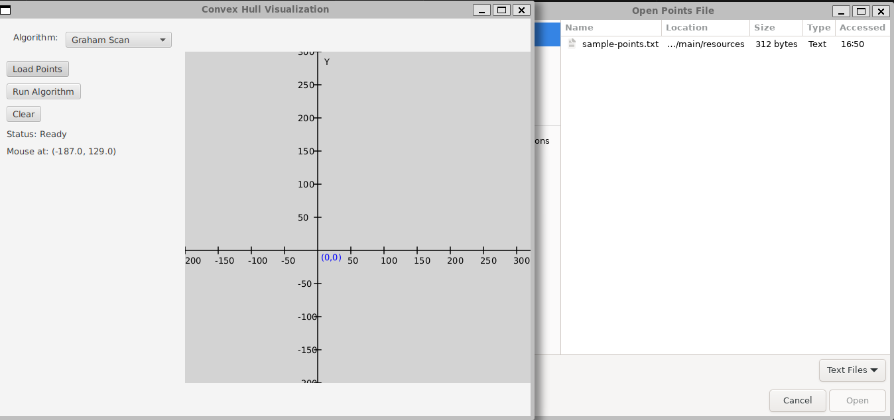
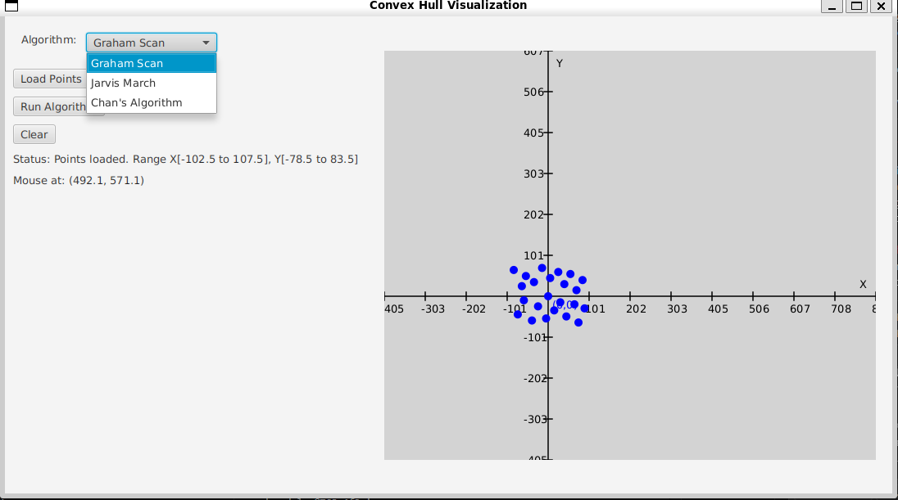
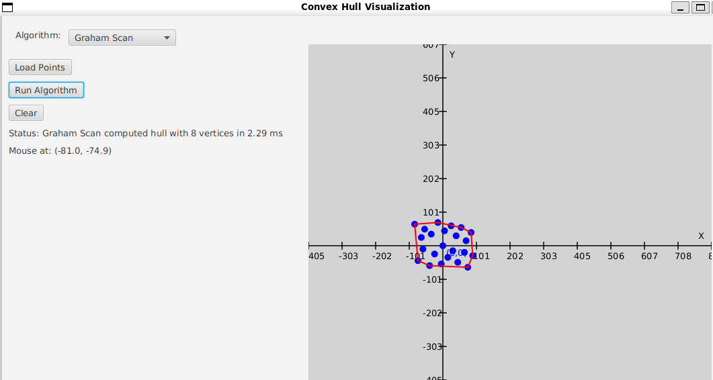

# README.md

# Convex Hull Algorithms

This project implements various algorithms to compute the convex hull of a set of points in 2D space. The following algorithms are included:

- Graham Scan
- Chan's Algorithm
- Merge Hull

## Project Structure

```
convex-hull
├── src
│   ├── main
│   │   ├── java
│   │   │   ├── algorithms
│   │   │   │   ├── ConvexHullAlgorithm.java
│   │   │   │   ├── GrahamScan.java
│   │   │   │   ├── ChanAlgorithm.java
│   │   │   │   └── MergeHull.java
│   │   │   ├── geometry
│   │   │   │   ├── Point.java
│   │   │   │   └── GeometryUtil.java
│   │   │   ├── visualization
│   │   │   │   ├── HullVisualization.java
│   │   │   │   └── VisualizationPanel.java
│   │   │   └── ConvexHullDriver.java
│   │   └── resources
│   │       └── sample-points.txt
│   └── test
│       └── java
│           ├── algorithms
│           │   ├── GrahamScanTest.java
│           │   ├── ChanAlgorithmTest.java
│           │   └── MergeHullTest.java
│           └── geometry
│               └── GeometryUtilTest.java
├── pom.xml
└── README.md
```

## Setup Instructions

1. **Clone the Repository**:
   ```bash
   git clone https://github.com/microsoft/vscode-remote-try-java.git
   cd convex-hull
   ```

2. **Install Java**: Ensure you have JDK 11 or higher installed on your machine.

3. **Install JavaFX**: JavaFX is not included in the JDK by default. Download it from the official website: [JavaFX](https://openjfx.io/).

4. **Add JavaFX to Your Project**:
   - If you are using Maven (Version 3.8.7), add the following dependencies to your `pom.xml`:
   ```xml
   <dependency>
       <groupId>org.openjfx</groupId>
       <artifactId>javafx-controls</artifactId>
       <version>YOUR_JAVAFX_VERSION</version>
   </dependency>
   <dependency>
       <groupId>org.openjfx</groupId>
       <artifactId>javafx-fxml</artifactId>
       <version>YOUR_JAVAFX_VERSION</version>
   </dependency>
   ```

5. **Configure Your IDE**: Make sure to configure your IDE to include the JavaFX libraries in the build path.

6. **Run the Application**: When running your application, you may need to specify the JavaFX modules. For example:
   ```bash
   java --module-path /path/to/javafx-sdk/lib --add-modules javafx.controls,javafx.fxml -jar your-application.jar
   ```

   Replace `/path/to/javafx-sdk/lib` with the actual path to your JavaFX SDK.

## Screenshots

Save your screenshot images (e.g. `screenshots/visualization.png`) in the repo and reference them directly:
```markdown



```

## Usage

- Place your sample points in the `src/main/resources/sample-points.txt` file.
- Build and run the JavaFX visualization:
```bash
# Compile and execute the JavaFX application
mvn clean compile exec:java -Dexec.mainClass="visualization.ConvexHullApp"
# Or run the driver class
mvn clean compile exec:java -Dexec.mainClass="ConvexHullDriver"
```

## Testing

Unit tests for each algorithm live in `src/test/java`. Use the following commands:
```bash
# Run all tests
mvn test

# Run individual test classes
mvn test -Dtest=GrahamScanTest
mvn test -Dtest=ChanAlgorithmTest
mvn test -Dtest=JarvisMarchTest
mvn test -Dtest=MergeHullTest
```  

## License

This project is licensed under the MIT License. See the LICENSE file for more details.